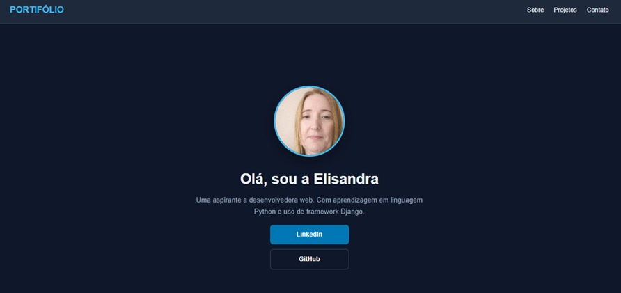

 
  <h1>Portifólio - Descrição Profissional</h1> 
  
<em>Professional Description</em>

   

 

---

# 📌 Portifólio

**PT-BR:**  
Portifólio é uma aplicação web com minha descrição profissional de forma interativa na área computacional.

*EN:*  
*Portifolio is a web application that interactively presents my professional background in the field of computing.*

---

# 🚀 Tecnologias Utilizadas

*EN: Used Technologies*

🔹 **HTML5** — Estrutura / *Structure*  
🔹 **CSS3** — Estilização / *Styling*

---

# 🎯 Objetivo do Projeto

**PT-BR:**  
O **portifólio** foi desenvolvido como uma plataforma experimental para:

- desenvolvimento de aplicações web  
- navegação simples  
- responsividade  

O projeto prioriza simplicidade e responsividade para facilitar experimentação e acesso.

*EN:*  
*The **portifolio** was developed as an experimental platform for:*

- *web application development*  
- *simple navigation*  
- *responsiveness*  

*The project prioritizes simplicity and responsiveness to facilitate experimentation and access.*

---

# 📄 Licença

**PT-BR:**  
Este projeto foi criado para fins educacionais e de treinamento de software.

O uso, modificação e redistribuição são permitidos livremente **desde que a autoria original seja mantida**.

Remover ou ocultar a autoria original é expressamente proibido. Caso a autoria seja removida, **você não tem permissão para usar este código em nenhuma forma**.

*EN:*  
*This project was created for educational and software training purposes.*

*Use, modification, and redistribution are freely permitted **provided that the original authorship is maintained**.*

*Removing or concealing the original attribution is expressly prohibited. If the attribution is removed, **you are not permitted to use this code in any way.***